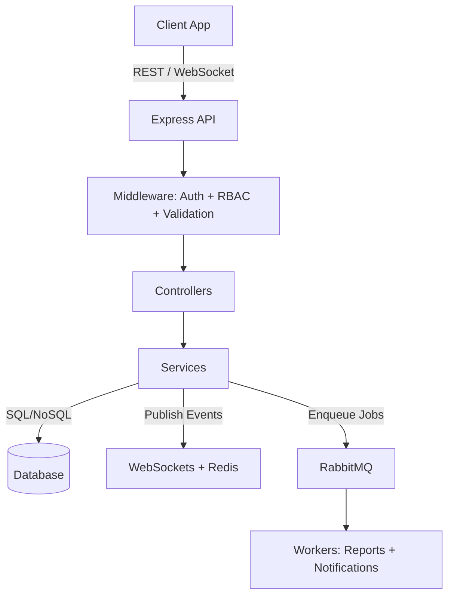

#  HealthConnect Platform – Backend

A **scalable, secure, real-time healthcare platform backend** built with **Node.js, Express, TypeScript, PostgreSQL, Redis, RabbitMQ, and WebSockets**.
It powers patient management, real-time updates, secure authentication with OIDC, and async background job processing for notifications & reports.

---

##  Features

* **Authentication & Security**

  * OpenID Connect (OIDC) + JWT
  * Role-Based Access Control (RBAC) for Admin, Doctor, Nurse
  * Validation & centralized error handling

* **Real-Time Communication**

  * WebSocket support with **Redis Pub/Sub**
  * Patient-specific channels (doctors/nurses instantly see updates)

* **Asynchronous Processing**

  * **RabbitMQ** for background jobs
  * Notification service (email/SMS)
  * Report generation with retry + DLQ

* **Robust Data Layer**

  * PostgreSQL / MongoDB models for Patients, Users, Reports
  * Services architecture for clean business logic

* **Testing**

  * Unit tests (services)
  * Integration tests (routes, WebSocket, RabbitMQ)

---

##  Architecture



---

##  Project Structure

```
/project-root
│── app.ts                  # Entry point (routes, db, sockets, jobs)
│── server.ts               # Starts server
│── config/                 # DB, Redis, RabbitMQ, OIDC configs
│── middleware/             # Auth, RBAC, validation, error handling
│── routes/                 # REST API routes
│── controllers/            # Handle requests & responses
│── services/               # Core business logic
│── models/                 # DB schemas/models
│── sockets/                # WebSocket setup
│── jobs/                   # Background workers
│── tests/                  # Unit & integration tests
│── utils/                  # Logger, constants
```

---

##  Flow Example: Patient Update

1. Doctor updates patient record → `PUT /patients/:id`
2. Request passes through:

   * `auth.ts` (JWT/OIDC validation)
   * `rbac.ts` (only doctors can edit patients)
   * `validation.ts` (input check)
3. `patientController.ts` → `patientService.ts` updates DB
4. Service:

   * Triggers WebSocket via **Redis** (notify connected clients)
   * Enqueues **RabbitMQ** job for notification (SMS/email)
5. Clients instantly see updates in their dashboard

---

##  Testing

* **Unit Tests:** Validate services independently
* **Integration Tests:** Test API + DB + WebSockets + Jobs together

---

##  Tech Stack

* **Backend:** Node.js, Express, TypeScript
* **Database:** PostgreSQL / MongoDB
* **Messaging:** RabbitMQ, Redis
* **Auth:** OpenID Connect (OIDC), JWT
* **Real-Time:** WebSockets + Redis Pub/Sub
* **Testing:** Jest / Mocha + Supertest

---

##  Next

* [ ] Adding **API Gateway** (for multi-service routing)
* [ ] Adding **Kubernetes Deployment** (scalability)
* [ ] Implementing **CI/CD pipeline** with GitHub Actions
* [ ] Expanding **Monitoring & Logging** with Prometheus + Grafana

---
**backend engineering expertise** in scalable microservice architecture, real-time data, and secure healthcare-grade systems.
