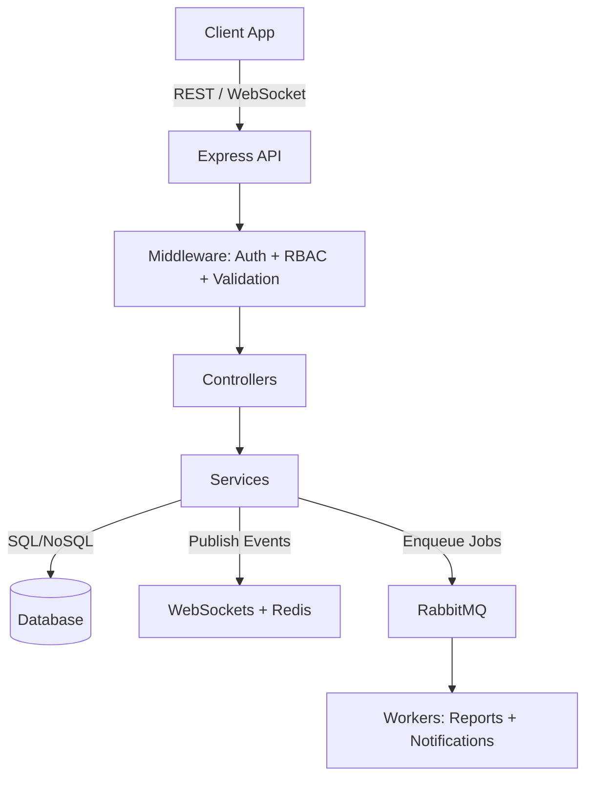

````
# HealthConnect Platform – Scalable Real-Time Healthcare Backend

A production-style, scalable healthcare backend platform built with **Node.js, Express, TypeScript, PostgreSQL, Redis, RabbitMQ, and WebSockets**.

Designed using modern backend engineering principles including **event-driven architecture, asynchronous job processing, secure authentication, real-time communication, and modular service-based design**.

This platform enables secure patient management, live healthcare updates, background report processing, and notification delivery for healthcare-grade applications.

---

##  Key Features

###  Authentication & Security
- OpenID Connect (OIDC) authentication
- JWT-based authorization
- Role-Based Access Control (RBAC)
  - Admin
  - Doctor
  - Nurse
- Secure middleware pipeline
- Centralized error handling & validation
- Protected REST APIs and WebSocket channels

---

###  Real-Time Communication
- WebSocket-based live updates
- Redis Pub/Sub for scalable socket event distribution
- Real-time patient status synchronization
- Channel-based communication for healthcare staff

Example:
- Doctors instantly receive patient updates
- Nurses receive live status changes
- Real-time dashboard synchronization

---

###  Event-Driven Background Processing
- RabbitMQ-powered asynchronous job queues
- Decoupled worker architecture
- Retry mechanism + Dead Letter Queue (DLQ)
- Background processing for:
  - Email notifications
  - SMS alerts
  - Report generation
  - Audit logging

---

###  Scalable Data Layer
- PostgreSQL relational database support
- MongoDB-ready architecture support
- Modular services architecture
- Clean separation of:
  - Controllers
  - Services
  - Models
  - Middleware
  - Jobs

---

###  Testing & Reliability
- Unit testing for services and utilities
- Integration testing for APIs and messaging flows
- WebSocket event testing
- Queue/job workflow testing

---

#  System Architecture

```mermaid
flowchart TD
    A[Client Applications] -->|REST API / WebSocket| B[Express API Gateway]

    B --> C[Authentication & RBAC Middleware]
    C --> D[Controllers]
    D --> E[Service Layer]

    E -->|SQL Queries| F[(PostgreSQL)]
    E -->|Publish Events| G[Redis Pub/Sub]
    G --> H[WebSocket Server]

    E -->|Enqueue Jobs| I[RabbitMQ]
    I --> J[Worker Services]

    J --> K[Notifications]
    J --> L[Report Generation]
````

---

#  Project Structure

```bash
/project-root
│
├── app.ts                    # Application configuration
├── server.ts                 # Server bootstrap
│
├── config/                   # Environment & infrastructure configs
│   ├── database.ts
│   ├── redis.ts
│   ├── rabbitmq.ts
│   └── oidc.ts
│
├── middleware/               # Auth, RBAC, validation, error handling
│
├── routes/                   # REST API endpoints
├── controllers/              # Request/response handlers
├── services/                 # Core business logic
├── models/                   # Database models/schemas
│
├── sockets/                  # WebSocket infrastructure
├── jobs/                     # RabbitMQ workers & consumers
│
├── tests/                    # Unit & integration tests
├── utils/                    # Logger, helpers, constants
│
└── docs/                     # Architecture & API documentation
```

---

#  Request Flow Example

## Patient Record Update Flow

### Step 1 — API Request

Doctor updates patient information:

```http
PUT /patients/:id
```

---

### Step 2 — Middleware Pipeline

Request passes through:

* JWT/OIDC authentication
* RBAC authorization
* Request validation
* Error handling middleware

---

### Step 3 — Business Logic Execution

`patientController.ts`
→ calls
`patientService.ts`

Service updates patient records in PostgreSQL.

---

### Step 4 — Real-Time Event Distribution

After successful update:

* Redis Pub/Sub broadcasts events
* WebSocket server pushes updates to connected dashboards

Healthcare staff immediately see updated patient information.

---

### Step 5 — Background Job Processing

RabbitMQ queues asynchronous tasks:

* Email notifications
* SMS alerts
* Report generation
* Audit logging

Workers process jobs independently for improved scalability and fault tolerance.

---

#  Testing Strategy

### Unit Tests

* Services
* Utilities
* Middleware
* Business logic

### Integration Tests

* REST API endpoints
* Authentication flow
* WebSocket communication
* RabbitMQ queue processing
* Database integration

---

#  Technology Stack

| Category       | Technologies                   |
| -------------- | ------------------------------ |
| Backend        | Node.js, Express, TypeScript   |
| Database       | PostgreSQL, MongoDB            |
| Real-Time      | WebSockets, Redis Pub/Sub      |
| Messaging      | RabbitMQ                       |
| Authentication | OpenID Connect (OIDC), JWT     |
| Testing        | Jest, Mocha, Supertest         |
| Architecture   | Event-Driven, Service-Oriented |

---

#  Scalability & Engineering Highlights

* Event-driven backend architecture
* Real-time distributed communication
* Async queue processing
* Modular scalable services
* Fault-tolerant job workers
* Secure authentication & authorization
* Production-style backend design patterns

---

#  Enhancements

* [ ] API Gateway integration
* [ ] Docker containerization
* [ ] Kubernetes orchestration
* [ ] CI/CD with GitHub Actions
* [ ] Prometheus + Grafana monitoring
* [ ] Distributed tracing
* [ ] Rate limiting & API throttling
* [ ] Multi-tenant healthcare support

---

#  Engineering Focus

This project demonstrates backend engineering expertise in:

* Scalable distributed systems
* Real-time application architecture
* Queue-based asynchronous processing
* Secure healthcare-grade backend systems
* Production-ready TypeScript backend development
* Modern microservice-oriented design patterns

##  Architecture


```mermaid
flowchart TD
    A[Client App] -->|REST / WebSocket| B[Express API]
    B --> C[Middleware: Auth + RBAC + Validation]
    C --> D[Controllers]
    D --> E[Services]
    E -->|SQL/NoSQL| F[(Database)]
    E -->|Publish Events| G[WebSockets + Redis]
    E -->|Enqueue Jobs| H[RabbitMQ]
    H --> I[Workers: Reports + Notifications]
```

---


